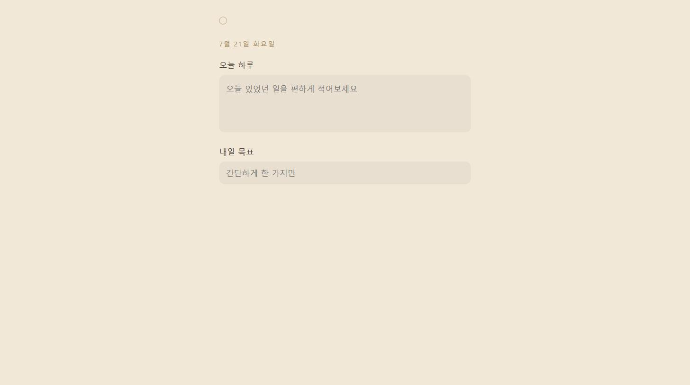

# 밤일기 (Night Diary)

자기 직전, 딱 두 가지만 적는 초미니멀 일기 PWA — 오늘 있었던 일 한 줄, 내일 목표 한 줄.

🔗 **써보기**: https://bongbong06.github.io/night-diary/ (폰 브라우저에서 열고 "홈 화면에 추가"로 앱처럼 설치 가능)



## 왜 만들었나

일기 앱은 이미 많지만, 대부분 태그·통계·클라우드 동기화 같은 기능이 붙어 있어서 오히려 "자기 전에 부담 없이 30초 쓰고 끝"이라는 용도엔 안 맞았다. 그래서 기능을 일부러 거의 다 뺐다: 로그인 없음, 알림 없음, 수정 이력 없음. 남긴 건 딱 두 입력창뿐이다.

## 주요 기능

- **오늘 하루 / 내일 목표** — 자유롭게 늘어나는 텍스트박스 + 한 줄 입력창. 타이핑하면 자동 저장(별도 저장 버튼 없음)
- **당일만 수정 가능** — 날짜가 지나면 그 기록은 자동으로 읽기 전용이 됨
- **어제 목표 리마인드** — 오늘 화면 상단에 어제 적어둔 "내일 목표"를 조용히 다시 보여줌
- **숨겨진 지난 기록** — 우측 상단의 아주 작은 점 아이콘을 눌러야만 지난 기록 목록/상세로 진입. 메인 화면엔 어떤 목록 버튼도 없음
- **오프라인 설치(PWA)** — 서버·로그인 없이 기기 로컬(`localStorage`)에만 저장, 홈 화면에 추가해 오프라인에서도 실행

## 설계 과정

기능을 붙이기 전에 먼저 무엇을 안 만들지부터 정했다. 색상 3안(웜 다크/세이지 다크/세피아 라이트)과 "지난 기록" 진입 방식 3안(스와이프/점 아이콘/당겨서 보기)을 실제 목업으로 비교한 뒤 결정했고, 그 과정과 결정 근거를 [설계 문서](docs/superpowers/specs/2026-07-21-bedtime-diary-design.md)로 남겼다.

## 기술 스택

프레임워크·빌드 도구 없이 순수 HTML/CSS/JS로만 작성했다 (앱 규모상 React 같은 도구는 과했다고 판단). 데이터는 `localStorage`에만 저장하고 서버는 없다. `manifest.json` + 서비스워커(`sw.js`)로 PWA 설치와 오프라인 캐싱을 지원한다.

| 파일 | 역할 |
|---|---|
| `index.html` | 오늘 화면 / 지난 기록 목록 / 지난 기록 상세, 3개 뷰를 담은 단일 페이지 |
| `style.css` | 세피아 라이트 팔레트, 카드형 입력창 스타일 |
| `app.js` | 날짜 계산, localStorage 저장/조회, 당일 잠금, 지난 기록 렌더링 |
| `manifest.json` / `sw.js` / `icon.svg` | PWA 설치 및 오프라인 캐싱 |

## 로컬 실행

```bash
python -m http.server 8765
# 브라우저에서 http://localhost:8765 접속
```

## 규모 & 한계 (정직하게)

- 코드량: 6개 파일, 약 434줄 — 하루 만에 브레인스토밍부터 배포까지 끝낸 개인 프로젝트다. 스타/포크는 아직 0개(공개한 지 얼마 안 됨)
- 자동화된 테스트나 CI는 없다. 실제 배포 후 브라우저로 직접 눌러보며 수동 QA했고, 그 과정에서 "지난 기록 화면이 겹쳐 보이는 버그"와 "서비스워커가 옛날 CSS를 캐싱해서 못 내려가는 버그"를 발견해 바로 고쳤다 (커밋 히스토리에 그대로 남아 있음)
- 여러 기기 간 동기화는 없다 — 의도적으로 뺀 기능이다 (설계 문서 참고)

## 라이선스

별도 라이선스 파일 없음 (개인 포트폴리오 프로젝트)
